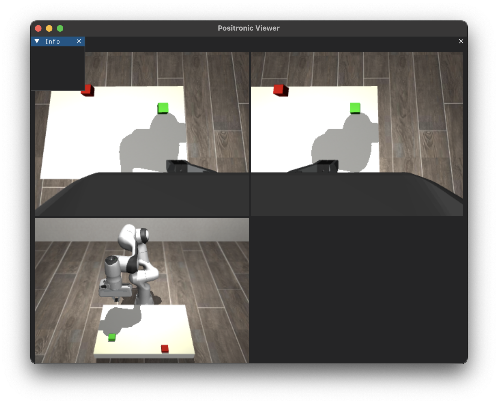
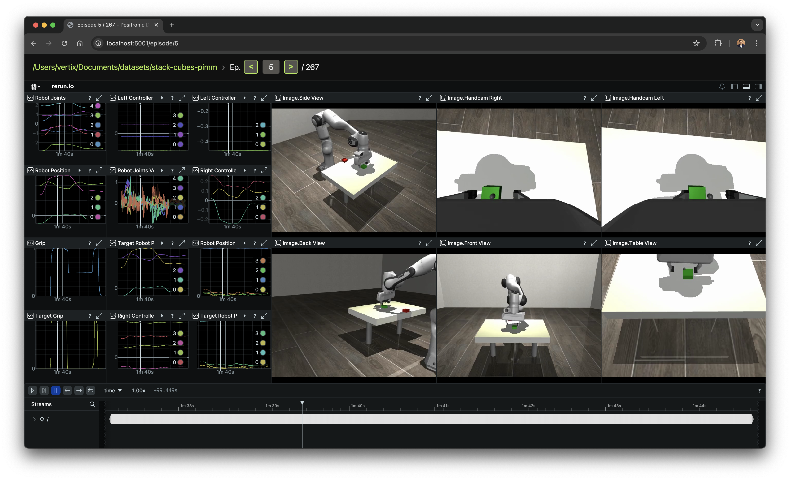

# Positronic — Python-native stack for real-life ML robotics

[](https://www.python.org/downloads/)
[](LICENSE)
[](https://github.com/Positronic-Robotics/positronic/actions/workflows/unit-test.yaml)
[](https://pypi.org/project/positronic/)

## What is Positronic

Positronic is an end-to-end toolkit for building ML-driven robotics systems.

It covers the full lifecycle:
- bring new hardware online,
- capture and curate datasets,
- train and evaluate policies,
- deploy inference,
- monitor performance,
- and iterate when behaviour drifts.

Every subsystem is implemented in plain Python so teams can move between simulation, teleoperation, and production code without switching languages or tools.

**Our goal is to make professional-grade ML robotics approachable.** Newcomers get clear defaults, WebXR teleoperation, and a reproducible training story; experienced teams can extend the same stack with custom drivers, schedulers, and datasets to support complex manipulation setups and large fleets.

> **Positronic is under heavy development and in alpha stage. APIs, interfaces, and workflows may change significantly between releases.**


## Table of Contents
- [Why Positronic](#why-positronic)
- [Installation](#installation)
- [Core modules at a glance](#core-modules-at-a-glance)
- [End-to-end workflow](#end-to-end-workflow)
  - [1. Prepare the environment](#1-prepare-the-environment)
  - [2. Collect demonstrations](#2-collect-demonstrations)
  - [3. Review and curate datasets](#3-review-and-curate-datasets)
  - [4. Convert to LeRobot](#4-convert-to-lerobot)
  - [5. Train a policy](#5-train-a-policy)
  - [6. Validate policies](#6-validate-policies)
- [Tooling and further reading](#tooling-and-further-reading)
- [Development workflow](#development-workflow)
- [How Positronic differs from LeRobot](#how-positronic-differs-from-lerobot)
- [Roadmap](#roadmap)

## Why Positronic

- **Immediate-mode runtime.** [`pimm`](pimm/README.md) wires sensors, controllers, inference, and GUIs without ROS launch files or bespoke DSLs. Loops stay testable and readable; see the [Pimm README](pimm/README.md) for details.
- **Dataset infrastructure.** The [Positronic dataset library](positronic/dataset/README.md) layer captures multi-rate episodes, exposes lazy transforms, and feeds the web-based browser for triage and analysis (see the [Dataset README](positronic/dataset/README.md)).
- **Hardware-ready out of the box.** [WebXR driver](positronic/drivers/webxr.py), [MuJoCo integration](positronic/simulator/mujoco/sim.py), the [DearPyGui UI](positronic/gui/dpg.py), and the [Drivers package](positronic/drivers) live alongside training and inference scripts so you can go from prototype to lab deployment quickly.
- **Future-facing roadmap.** Native training on Positronic datasets, curation capabilities in the viewer server, out-of-the-box support for $\pi_0$, GR00T and other polcies, support for more robotic and controlling hardware are active areas of development. Everything in this README reflects the workflow we run today and the direction we are pushing toward.

---

## Installation

Clone the repository and set up a local `uv` environment (recommended) or use Docker if you prefer containers.

### Option 1: Local via uv (recommended)

Prerequisites: Python 3.11 and [uv](https://docs.astral.sh/uv/).

```bash
git clone git@github.com:Positronic-Robotics/positronic.git
cd positronic

uv venv -p 3.11               # optional but keeps the interpreter isolated
source .venv/bin/activate     # activate the venv if you created one
uv sync --frozen --extra dev  # install core + dev tooling
```

Install hardware extras only when you need physical robot drivers:

```bash
uv sync --frozen --extra hardware
```

All runtime commands in the sections below assume either an activated virtual environment or `uv run --with-editable . -s …`.

### Option 2: Docker

```bash
git clone git@github.com:Positronic-Robotics/positronic.git
cd positronic

./docker/build.sh            # build image (includes libfranka and uv.lock deps)
./docker/run.sh pytest       # run commands inside the container
```
---

## Core modules at a glance

- [`pimm`](pimm/README.md) — immediate-mode runtime for building control systems. Handy references: [README](pimm/README.md), [Data collection example](positronic/data_collection.py), [Inference example](positronic/run_inference.py).
- [Positronic dataset library](positronic/dataset/README.md) — dataset writer/reader, transforms, and streaming agent.
- [Positronic server](positronic/server/positronic_server.py) — FastAPI + Rerun viewer for inspecting recordings.
- [Training scripts](positronic/training) — scripts for converting datasets and running LeRobot pipelines while native Positronic training is being finalised.
- [Drivers package](positronic/drivers) — hardware definitions, WebXR frontends, simulator loaders, and [Config presets](positronic/cfg) ready to override per project.

---

## End-to-end workflow

The usual loop is: collect demonstrations → inspect and curate → (temporarily) convert to LeRobot → train → validate. The sections below link straight to the scripts that implement each step.

### 1. Prepare the environment

- Create or activate your Python environment as shown above.
- For simulation-only workflows no additional extras are required.
- Hardware users should also provision device-level dependencies (e.g., udev rules for cameras) as described in the relevant driver documentation under [Drivers package](positronic/drivers/).

### 2. Collect demonstrations

Use the [Data collection script](positronic/data_collection.py) for both simulation and hardware captures.

#### Quick start in simulation

```bash
python -m positronic.data_collection sim \
    --output_dir=~/datasets/stack_cubes_raw \
    --webxr=.oculus \
    --operator_position=OperatorPosition.BACK
```

This command loads the [MuJoCo scene](positronic/assets/mujoco/franka_table.xml) with loaders from the [simulator config](positronic/cfg/simulator.py), starts the [DearPyGui UI](positronic/gui/dpg.py), and records into the [Local dataset writer](positronic/dataset/local_dataset.py).




#### Driving physical robots

Choose the configuration that matches your setup — all presets are defined in [Data collection script](positronic/data_collection.py) using `configuronic`:

```bash
python -m positronic.data_collection real  --output_dir=~/datasets/franka_kitchen
python -m positronic.data_collection so101 --output_dir=~/datasets/so101_runs
python -m positronic.data_collection droid --output_dir=~/datasets/droid_runs
```

Override components inline (e.g. `--webxr=.iphone`, `--sound=None`, `--operator_position=.FRONT`) or add new configs under [Hardware configs](positronic/cfg/hardware/).

#### Teleoperate with a VR headset (Meta Quest / Oculus)

Both sim and real robots can be controlled by position tracking devices, such as VR Helmet (we use Oculus Quest 3, though any VR device will work) or even phone with WebXR-enabled browser.

Here's how to collect the data using VR Helmet:
1. Launch a collector command with `--webxr=.oculus`.
2. Find the host machine’s IP address (`ipconfig getifaddr en0` on macOS, `hostname -I` on Linux) and connect the headset to the same network.
3. In the headset open **Oculus Browser**, navigate to `https://<host-ip>:5005/`, and accept the security warning once (Advanced → Continue). The certificate is generated by [WebXR driver](positronic/drivers/webxr.py).
4. Click **Enter AR** in the page header and approve the permission dialog so the browser can read tracking data.
5. If you started the collector with `--stream_video_to_webxr=<camera_name>`, a floating panel shows the chosen camera feed. `<camera_name>` must match a key in the `cameras` mapping passed to the collector.
6. Controller mappings (handled by [Button mapping helper](positronic/utils/buttons.py)):
   - **Right B** — start/stop recording (audio cues play if sound is enabled).
   - **Right A** — toggle positional tracking to align the controller pose with the robot.
   - **Right stick press** — abort the current episode and send `roboarm.command.Reset()`.
   - **Right trigger** — analogue gripper control (captured as the `target_grip` signal).

#### Use an iPhone as a controller

1. Launch data collection with `--webxr=.iphone` (frontend defined in [WebXR config](positronic/cfg/webxr.py)).
2. On the phone open **XR Browser** (or any WebXR-capable browser) and visit `http://<host-ip>:5005/`.
3. Tap **Enter AR**, grant camera/gyroscope access, and hold the phone upright; the reticle represents the virtual controller.
4. The on-screen HUD from [WebXR phone UI](positronic/assets/webxr_iphone/index.html) provides:
   - **Record** for episode start/stop.
   - **Track**  to toggle positional tracking.
   - **Reset**  to abort the current run and resetting the robot.
   - **Gripper slider** to control the width of your gripper.

#### Collection tips

- Watch the DearPyGui window to confirm cameras and robot state update reliably. Restart an episode instead of saving partial data when something goes wrong.
- Record a few calibration runs first, review them, then capture full demonstrations.

### 3. Review and curate datasets

Browse datasets with the [Positronic Server app](positronic/server/positronic_server.py).

Inspect recordings before training:

```bash
python -m positronic.server.positronic_server \
    --root=~/datasets/stack_cubes_raw \
    --port=5001
```

The viewer loads `LocalDataset` in the background, generates `.rrd` files with the copies of each episode under `~/.cache/positronic/server/`, and serves a Rerun viewer per episode.



The UI is read-only for now: mark low-quality runs while watching, then rename or remove the corresponding episode directories manually. Static metadata lives in each episode’s `episode.json` if you need to edit it outside the GUI.

We will support curation mode in the future releases.

### 4. Convert to LeRobot

Use the [LeRobot conversion helper](positronic/training/to_lerobot.py) until native training lands.

Until training scripts consume Positronic datasets directly, convert curated runs into LeRobot format:

```bash
uv run --with-editable . -s positronic/training/to_lerobot.py convert \
    --dataset.path=~/datasets/stack_cubes_raw \
    --output_dir=~/datasets/lerobot/stack_cubes \
    --task="pick up the green cube and place it on the red cube" \
    --fps=30
```

The converter reads your data through `positronic.cfg.dataset.transformed` (see [Dataset config module](positronic/cfg/dataset.py)), applies the same observation/action transforms used at inference time, and writes a `LeRobotDataset`. Re-run the command whenever you tweak transforms or add new episodes. To extend an existing LeRobot dataset:

```bash
uv run --with-editable . -s positronic/training/to_lerobot.py append \
    --dataset_dir=~/datasets/lerobot/stack_cubes \
    --dataset.path=~/datasets/stack_cubes_new
```

Keep the original Positronic datasets — once native training lands you will no longer need this conversion step.

### 5. Train a policy

Run the [LeRobot training driver](positronic/training/lerobot_train.py) with Positronic configs.

Train an ACT policy using LeRobot’s pipeline configured for Positronic observations and actions:

```bash
uv run --with-editable . -s positronic/training/lerobot_train.py \
    --dataset_root=~/datasets/lerobot/stack_cubes \
    --base_config=positronic/training/train_config.json
```

Checkpoints and logs are written under `outputs/train/<timestamp>_<job_name>/`. Adjust the [training script](positronic/training/lerobot_train.py) to change architectures, backbones, or devices. When Positronic-first training is ready you will point the trainer at the raw dataset instead.

### 6. Validate policies

Replay checkpoints through the [Inference script](positronic/run_inference.py) to test in MuJoCo or log hardware runs.

Run the trained policy in MuJoCo, record diagnostics, and optionally stream a GUI:

```bash
python -m positronic.run_inference sim_act \
    --policy.checkpoint_path=~/datasets/lerobot/stack_cubes/checkpoints/last/pretrained_model \
    --device=mps \
    --simulation_time=60 \
    --output_dir=~/datasets/inference_logs/stack_cubes_act \
    --show_gui
```

The [Inference script](positronic/run_inference.py) wires the MuJoCo scene, [Observation encoders](positronic/cfg/policy/observation.py), and [Action decoder](positronic/cfg/policy/action.py). Passing `--output_dir` enables another `DsWriterAgent` so the run can be replayed in the dataset viewer.

---

## Development workflow

Run tests and linters from the root directory:

```bash
uv run pytest --no-cov
uv run flake8
```

Use `uv add` / `uv remove` to modify dependencies and `uv lock` to refresh the lockfile. Contributions should include or update tests when code changes affect behaviour.

## How Positronic differs from LeRobot

[LeRobot](https://github.com/huggingface/lerobot) packages imitation- and reinforcement-learning algorithms, public datasets, and affordable reference robots so anyone can train and share policies. Positronic builds on that progress but is **aimed at teams running professional systems end to end**:

- **Runtime & middleware.** [`pimm`](pimm/README.md) wires sensors, arms, teleop clients, and inference loops on production hardware without ROS launch files or bespoke DSLs.
- **Data operations.** [Positronic dataset library](positronic/dataset/README.md) is a powerful library for robotic datasets.
- **Deployment & supervision.** WebXR teleoperation ([WebXR config](positronic/cfg/webxr.py)), simulator loaders ([MuJoCo transform helpers](positronic/simulator/mujoco/transforms.py)), an expanding set of hardware drivers ([Drivers package](positronic/drivers)), and inference loggers ([Inference script](positronic/run_inference.py)) help you roll out policies, watch live telemetry, and capture diagnostics for regression analysis.

LeRobot is the learning engine; Positronic is the operations stack that keeps data flowing, policies running, and teams iterating on real robots.

## Roadmap

Our plans evolve with your feedback. Highlights for the next milestones:

- **Short term**
  - **Policy presets for $\pi_0$ and GR00T.** Bundle ready-to-use configs in [policy config module](positronic/cfg/policy/policy.py) so switching policies is a single flag.
  - **Automated evaluation harness.** Extend [Inference script](positronic/run_inference.py) and the MuJoCo loaders in [MuJoCo transform helpers](positronic/simulator/mujoco/transforms.py) to score new checkpoints automatically on curated scenarios.
  - **Richer Positronic Server.** Teach [Positronic Server](positronic/server/positronic_server.py) to open transformed datasets, surface static/meta fields, and offer annotation + filtering flows for rapid triage.
  - **PyTorch bridging layer.** Provide a native adapter on top of [Positronic dataset library](positronic/dataset/README.md) so training scripts can stream tensors without an intermediate export.
  - **Direct LeRobot integration.** Let [LeRobot training driver](positronic/training/lerobot_train.py) read Positronic datasets directly, retiring the temporary [LeRobot conversion helper](positronic/training/to_lerobot.py) conversion.
  - **Remote inference primitives.** Add network-friendly transports to [Inference script](positronic/run_inference.py) so policies can live on a different machine than the robot.
- **Medium term**
  - **SO101 leader support.** Promote SO101 from follower mode to a first-class leader arm in [Hardware configs](positronic/cfg/hardware).
  - **New operator inputs.** Ship keyboard and gamepad controllers inside [Drivers package](positronic/drivers) for quick teleop on commodity hardware.
  - **Streaming datasets.** Introduce a cloud-ready dataset backend building on [Local dataset writer](positronic/dataset/local_dataset.py) for long-running data collection jobs.
  - **Community hardware.** Continue adding camera, gripper, and arm drivers requested by adopters.
- **Long term**
  - **Distributed scheduling.** Layer cross-machine orchestration on [`pimm`](pimm/README.md) so one supervisor can coordinate multiple collectors, trainers, and inference nodes.
  - **Hybrid cloud workflows.** Support ingestion of episodes straight into object storage while keeping local curation/debugging fast, plus optional cloud-hosted inference services.
  - **Remote inference in the cloud.** Deploy heavy but capable ML models in the cloud to control and operate your local hardware.

Let us know what you need at hi@positronic.ro or [open a feature request at Github](https://github.com/Positronic-Robotics/positronic/issues/new).